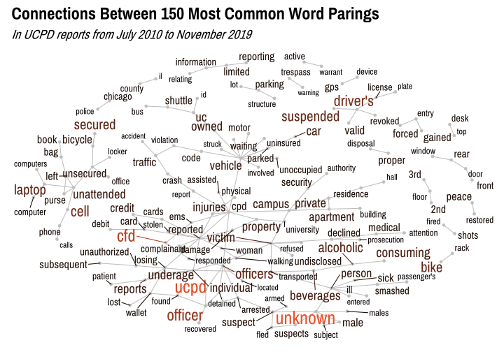

Analysis of UCPD Incident Reports
================
Adam Shelton

## Getting Started

``` r
process_date_range = Vectorize(function(d_range, start = TRUE) {
    intervals = str_split(d_range, "to") %>% unlist() %>% str_trim()
    if (length(intervals) == 2) {
        beginning = intervals[1] %>% str_squish() %>% str_split(" ") %>% 
            unlist()
        if (!start & !str_detect(intervals[2], "/")) {
            return(paste(beginning[1], intervals[2], sep = " "))
        } else if (!start) {
            return(intervals[2])
        }
    }
    if (length(intervals) == 3) {
        middle = intervals[2] %>% str_squish() %>% str_split(" ") %>% 
            unlist()
        if (start) {
            return(paste(intervals[1], middle[2], middle[3], 
                sep = " "))
        }
        return(paste(middle[1], intervals[3], sep = " "))
    }
    if (start) {
        return(intervals[1])
    }
    return(NA)
})

extract_date = Vectorize(function(date_char) {
    attempt = mdy_hm(date_char)
    # message(attempt)
    if (is.na(attempt) & !is.na(date_char)) {
        if (str_detect(date_char, " ")) {
            date_char = date_char %>% str_split(" ") %>% unlist() %>% 
                .[1]
        }
        # message(date_char)
        attempt = mdy(date_char) %>% as_datetime()
        # message(attempt)
    }
    return(attempt)
})

clean_disposition = function(disp_vector) {
    cpd_arrest = str_detect(disp_vector, "CPD") & str_detect(disp_vector, 
        "Arrest")
    cpd_alone = str_detect(disp_vector, "CPD") & !str_detect(disp_vector, 
        "Arrest")
    arrest_alone = str_detect(disp_vector, "Arrest") & !str_detect(disp_vector, 
        "CPD")
    disp_vector[cpd_arrest] = "CPD Arrest"
    disp_vector[cpd_alone] = "CPD Involved"
    disp_vector[arrest_alone] = "Arrest"
    closed = str_detect(disp_vector, "Closed") | str_detect(disp_vector, 
        "closed")
    disp_vector[closed] = "Closed"
    disp_vector[str_detect(disp_vector, "Clear")] = "Exceptionally Cleared"
    return(disp_vector)
}

ucpd_data = list.files(getwd(), pattern = "ucpd_crime_data_scraped_*") %>% 
    read_csv() %>% fix_nas(c(":", "VOID", "Void", "void", "n/a", 
    "N/A", "na", "NA", "No reports this date", "None")) %>% mutate(Reported = Reported %>% 
    mdy_hm(), Start = Occurred %>% process_date_range() %>% extract_date() %>% 
    as_datetime(), End = Occurred %>% process_date_range(FALSE) %>% 
    extract_date() %>% as_datetime(), Disposition = Disposition %>% 
    clean_disposition()) %>% drop_na(Reported) %>% collapse_to_other(10, 
    Disposition) %>% rename(Comments = `Comments / Nature of Fire`)
```

## Text Analysis

``` r
report_lines = ucpd_data %>% select(Comments) %>% rename(line = Comments)
report_words = report_lines %>% unnest_tokens(word, line) %>% 
    anti_join(stop_words)
```

    ## Joining, by = "word"

``` r
report_bigrams = report_lines %>% unnest_tokens(bigram, line, 
    token = "ngrams", n = 2, collapse = FALSE) %>% separate(bigram, 
    c("word1", "word2"), sep = " ") %>% filter(!word1 %in% stop_words$word) %>% 
    filter(!word2 %in% stop_words$word)

word_count = report_words %>% count(word, sort = TRUE)
bigram_count = report_bigrams %>% count(word1, word2, sort = TRUE)

word_count %>% top_n(15) %>% kable(caption = "15 Most Common Words")
```

    ## Selecting by n

<table>

<caption>

15 Most Common Words

</caption>

<thead>

<tr>

<th style="text-align:left;">

word

</th>

<th style="text-align:right;">

n

</th>

</tr>

</thead>

<tbody>

<tr>

<td style="text-align:left;">

unknown

</td>

<td style="text-align:right;">

3159

</td>

</tr>

<tr>

<td style="text-align:left;">

ucpd

</td>

<td style="text-align:right;">

2979

</td>

</tr>

<tr>

<td style="text-align:left;">

person

</td>

<td style="text-align:right;">

2459

</td>

</tr>

<tr>

<td style="text-align:left;">

cpd

</td>

<td style="text-align:right;">

2023

</td>

</tr>

<tr>

<td style="text-align:left;">

individual

</td>

<td style="text-align:right;">

1680

</td>

</tr>

<tr>

<td style="text-align:left;">

arrested

</td>

<td style="text-align:right;">

1647

</td>

</tr>

<tr>

<td style="text-align:left;">

victim

</td>

<td style="text-align:right;">

1383

</td>

</tr>

<tr>

<td style="text-align:left;">

reported

</td>

<td style="text-align:right;">

1382

</td>

</tr>

<tr>

<td style="text-align:left;">

campus

</td>

<td style="text-align:right;">

1339

</td>

</tr>

<tr>

<td style="text-align:left;">

vehicle

</td>

<td style="text-align:right;">

1322

</td>

</tr>

<tr>

<td style="text-align:left;">

suspect

</td>

<td style="text-align:right;">

1315

</td>

</tr>

<tr>

<td style="text-align:left;">

officer

</td>

<td style="text-align:right;">

1241

</td>

</tr>

<tr>

<td style="text-align:left;">

transported

</td>

<td style="text-align:right;">

1042

</td>

</tr>

<tr>

<td style="text-align:left;">

cfd

</td>

<td style="text-align:right;">

1024

</td>

</tr>

<tr>

<td style="text-align:left;">

motorist

</td>

<td style="text-align:right;">

1008

</td>

</tr>

</tbody>

</table>

``` r
bigram_count %>% top_n(15) %>% kable(caption = "15 Most Common Bigrams")
```

    ## Selecting by n

<table>

<caption>

15 Most Common Bigrams

</caption>

<thead>

<tr>

<th style="text-align:left;">

word1

</th>

<th style="text-align:left;">

word2

</th>

<th style="text-align:right;">

n

</th>

</tr>

</thead>

<tbody>

<tr>

<td style="text-align:left;">

unknown

</td>

<td style="text-align:left;">

person

</td>

<td style="text-align:right;">

1988

</td>

</tr>

<tr>

<td style="text-align:left;">

ucpd

</td>

<td style="text-align:left;">

officer

</td>

<td style="text-align:right;">

1159

</td>

</tr>

<tr>

<td style="text-align:left;">

cfd

</td>

<td style="text-align:left;">

ems

</td>

<td style="text-align:right;">

814

</td>

</tr>

<tr>

<td style="text-align:left;">

ucpd

</td>

<td style="text-align:left;">

officers

</td>

<td style="text-align:right;">

789

</td>

</tr>

<tr>

<td style="text-align:left;">

officer

</td>

<td style="text-align:left;">

arrested

</td>

<td style="text-align:right;">

756

</td>

</tr>

<tr>

<td style="text-align:left;">

driver’s

</td>

<td style="text-align:left;">

license

</td>

<td style="text-align:right;">

726

</td>

</tr>

<tr>

<td style="text-align:left;">

bike

</td>

<td style="text-align:left;">

rack

</td>

<td style="text-align:right;">

566

</td>

</tr>

<tr>

<td style="text-align:left;">

cell

</td>

<td style="text-align:left;">

phone

</td>

<td style="text-align:right;">

562

</td>

</tr>

<tr>

<td style="text-align:left;">

suspended

</td>

<td style="text-align:left;">

driver’s

</td>

<td style="text-align:right;">

439

</td>

</tr>

<tr>

<td style="text-align:left;">

officers

</td>

<td style="text-align:left;">

arrested

</td>

<td style="text-align:right;">

358

</td>

</tr>

<tr>

<td style="text-align:left;">

secured

</td>

<td style="text-align:left;">

bicycle

</td>

<td style="text-align:right;">

345

</td>

</tr>

<tr>

<td style="text-align:left;">

laptop

</td>

<td style="text-align:left;">

computer

</td>

<td style="text-align:right;">

343

</td>

</tr>

<tr>

<td style="text-align:left;">

alcoholic

</td>

<td style="text-align:left;">

beverages

</td>

<td style="text-align:right;">

322

</td>

</tr>

<tr>

<td style="text-align:left;">

consuming

</td>

<td style="text-align:left;">

alcoholic

</td>

<td style="text-align:right;">

310

</td>

</tr>

<tr>

<td style="text-align:left;">

victim

</td>

<td style="text-align:left;">

reported

</td>

<td style="text-align:right;">

296

</td>

</tr>

</tbody>

</table>

``` r
bigram_tops = bigram_count %>% top_n(150)
```

    ## Selecting by n

``` r
bigram_graph = bigram_tops %>% graph_from_data_frame()
graph_data = word_count %>% filter(word %in% names(bigram_graph[1]))

remove_axes = theme(axis.text = element_blank(), axis.line = element_blank(), 
    axis.ticks = element_blank(), panel.border = element_blank(), 
    panel.grid = element_blank(), axis.title = element_blank())

ggraph(bigram_graph, layout = "fr") + geom_edge_link(color = "grey") + 
    geom_node_point(color = "grey") + geom_node_text(aes(label = name, 
    size = graph_data$n, color = graph_data$n), nudge_x = 0, 
    nudge_y = 0, repel = TRUE, family = "Pragati Narrow") + scale_color_gradientn(colors = c("#000000", 
    color_pal(1, "discrete"))) + scale_size_continuous(range = c(4, 
    10)) + labs(title = "Connections Between 150 Most Common Word Parings", 
    subtitle = "In UCPD reports from July 2010 to September 2019") + 
    theme_master(base_size = 22) + remove_axes + hide_legend
```

<!-- -->
